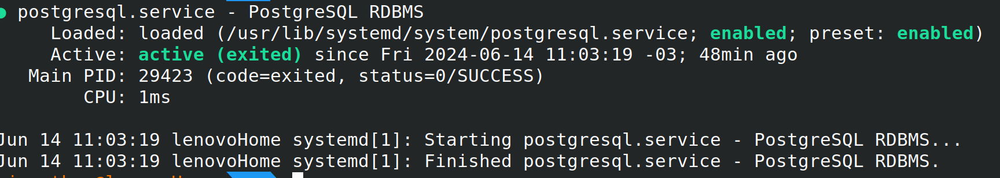

## INSTALL POSTGRESQL PSQL LINUX UBUNTU

Ubuntu includes PostgreSQL by default. To install PostgreSQL on Ubuntu, use the apt (or other apt-driving) command:
```BASH
apt install postgresql
```

PostgreSQL Apt Repository

```bash
sudo apt install -y postgresql-common
sudo /usr/share/postgresql-common/pgdg/apt.postgresql.org.sh
```
## Installing pgAdmin 4 on Ubuntu

1. Add pgAdmin4 repository
The pgAdmin packages for all Debian based Linux operating systems are available from the pgAdmin APT repository. In this step we will add the repository to our Ubuntu system.
curl  -fsSL https://www.pgadmin.org/static/packages_pgadmin_org.pub | sudo gpg --dearmor -o /etc/apt/trusted.gpg.d/pgadmin.gpg
Use the next command given to add pgAdmin repository in your Ubuntu system:
sudo sh -c 'echo "deb https://ftp.postgresql.org/pub/pgadmin/pgadmin4/apt/$(lsb_release -cs) pgadmin4 main" > /etc/apt/sources.list.d/pgadmin4.list'
You can check the contents of the repository file created using the following command:
```bash
$ cat /etc/apt/sources.list.d/pgadmin4.list
deb https://ftp.postgresql.org/pub/pgadmin/pgadmin4/apt/bullseye pgadmin4 main
```

2. Install pgAdmin4 on Ubuntu
Finally, update the package lists.
```bash
sudo apt update
```

To install pgAdmin4 packages on Ubuntu 22.04|20.04|18.04 system, run these commands, providing correct version number:
```bash
sudo apt install pgadmin4
```
Hit the y key to continue with the installation ofpgAdmin4 on Ubuntu 22.04|20.04|18.04.

```bash
....
  cpp-doc gcc-9-locales libdigest-hmac-perl libgssapi-perl libcrypt-ssleay-perl lm-sensors libauthen-ntlm-perl libunicode-map8-perl libunicode-string-perl xml-twig-tools postgresql-12
  postgresql-doc-12 mesa-utils nickle cairo-5c xorg-docs-core
The following NEW packages will be installed:
  cpp cpp-9 fontconfig-config fonts-dejavu-core gcc-9-base libapache2-mod-wsgi-py3 libatomic1 libauthen-sasl-perl libdata-dump-perl libdrm-amdgpu1 libdrm-intel1 libdrm-nouveau2 libdrm-radeon1
  libencode-locale-perl libfile-basedir-perl libfile-desktopentry-perl libfile-listing-perl libfile-mimeinfo-perl libfont-afm-perl libfontconfig1 libfontenc1 libgl1 libgl1-mesa-dri libglapi-mesa
  libglvnd0 libglx-mesa0 libglx0 libhtml-form-perl libhtml-format-perl libhtml-parser-perl libhtml-tagset-perl libhtml-tree-perl libhttp-cookies-perl libhttp-daemon-perl libhttp-date-perl
  libhttp-message-perl libhttp-negotiate-perl libice6 libio-html-perl libio-socket-ssl-perl libio-stringy-perl libipc-system-simple-perl libisl22 libllvm12 liblwp-mediatypes-perl
  liblwp-protocol-https-perl libmailtools-perl libmpc3 libnet-dbus-perl libnet-http-perl libnet-smtp-ssl-perl libnet-ssleay-perl libpciaccess0 libpq5 libsensors-config libsensors5 libsm6
  libtie-ixhash-perl libtimedate-perl libtry-tiny-perl liburi-perl libvulkan1 libwayland-client0 libwww-perl libwww-robotrules-perl libx11-protocol-perl libx11-xcb1 libxaw7 libxcb-dri2-0
  libxcb-dri3-0 libxcb-glx0 libxcb-present0 libxcb-randr0 libxcb-shape0 libxcb-shm0 libxcb-sync1 libxcb-xfixes0 libxcomposite1 libxcursor1 libxfixes3 libxft2 libxi6 libxinerama1 libxkbfile1
  libxml-parser-perl libxml-twig-perl libxml-xpathengine-perl libxmu6 libxpm4 libxrandr2 libxrender1 libxshmfence1 libxt6 libxtst6 libxv1 libxxf86dga1 libxxf86vm1 mesa-vulkan-drivers
  perl-openssl-defaults pgadmin4 pgadmin4-desktop pgadmin4-server pgadmin4-web postgresql-client postgresql-client-12 postgresql-client-common x11-common x11-utils x11-xserver-utils xdg-utils
0 upgraded, 110 newly installed, 0 to remove and 6 not upgraded.
Need to get 222 MB of archives.
After this operation, 508 MB of additional disk space will be used.
Do you want to continue? [Y/n] y

```
Apache service should have been started after installation.

```bash
$ systemctl status apache2
● apache2.service - The Apache HTTP Server
     Loaded: loaded (/lib/systemd/system/apache2.service; enabled; vendor preset: enabled)
     Active: active (running) since Fri 2023-06-16 12:21:28 UTC; 15s ago
       Docs: https://httpd.apache.org/docs/2.4/
    Process: 22562 ExecStart=/usr/sbin/apachectl start (code=exited, status=0/SUCCESS)
   Main PID: 22566 (apache2)
      Tasks: 55 (limit: 18678)
     Memory: 15.5M
        CPU: 204ms
     CGroup: /system.slice/apache2.service
             ├─22566 /usr/sbin/apache2 -k start
             ├─22568 /usr/sbin/apache2 -k start
             └─22569 /usr/sbin/apache2 -k start

Jun 16 12:21:28 jammy systemd[1]: Starting The Apache HTTP Server...
Jun 16 12:21:28 jammy systemd[1]: Started The Apache HTTP Server.
```
3. Configure Apache web server for pgAdmin4
Initiate Apache web server configuration.
```bash
sudo /usr/pgadmin4/bin/setup-web.sh
```
This will require you to input pgadmin4 user email address and set the password:
```bash
Setting up pgAdmin 4 in web mode on a Debian based platform...
Creating configuration database...
NOTE: Configuring authentication for SERVER mode.

Enter the email address and password to use for the initial pgAdmin user account:

Email address: <input-email-address>
Password: <input-password>
Retype password: <Reenter-password>
pgAdmin 4 - Application Initialisation
======================================

Creating storage and log directories...
```
Agree for the configuration of Apache Web server.
```bash
We can now configure the Apache Web server for you. This involves enabling the wsgi module and configuring the pgAdmin 4 application to mount at /pgadmin4. Do you wish to continue (y/n)? y
The Apache web server is running and must be restarted for the pgAdmin 4 installation to complete. Continue (y/n)? y
Apache successfully restarted. You can now start using pgAdmin 4 in web mode at http://127.0.0.1/pgadmin4
```
4. Access pgAdmin 4 Web interface
If you have UFW firewall configured, allow http and https traffic.
```bash
sudo ufw allow http
sudo ufw allow https
```
Open your browser and http://[ServerIP_or_domain]/pgadmin4.

## [How to Install PostgreSQL and pgAdmin Tool on Debian 12](https://www.howtoforge.com/how-to-install-postgresql-and-pgadmin-tool-on-debian-12/)

## Prerequisites
* A Debian 12 server.
* A non-root user with administrator privileges.

First, execute the following command to add the PostgreSQL repository for your Debian system.

```bash
sudo sh -c 'echo "deb [arch=amd64 signed-by=/usr/share/keyrings/pgdg.gpg] http://apt.postgresql.org/pub/repos/apt $(lsb_release -cs)-pgdg main" > /etc/apt/sources.list.d/pgdg.list'
```

Then add the GPG key of the PostgreSQL repository.

```bash
curl -fsSL https://www.postgresql.org/media/keys/ACCC4CF8.asc | sudo gpg --dearmor -o /usr/share/keyrings/pgdg.gpg
```

Now execute the following update on your available repositories and get the latest package information.

```bash
sudo apt update
```

Install the latest version of the PostgreSQL server via the apt install command below. Type y to confirm the installation and proceed.
```bash
sudo apt install postgresql
```

After PostgreSQL is installed, run the following systemctl command to ensure that the postgresql service is running.

```bash
sudo systemctl is-enabled postgresql
sudo systemctl status postgresql
```

The following output indicates that the postgresql service is running and enabled, and it will start automatically at system boot.



## ACESS POSTGRESQL SHELL

Execute the psql following command to access the PostgreSQL shell.

```bash
sudo -u postgres psql

# -u = user
# postgres = user name
# psql = postgresql
```

## CHANGE POSTGRES DEFAULT PASSWORD 
Now run the following query to change the password for the PostgreSQL default user postgres. Be sure to change the password in the following query.
```sql
ALTER USER postgres WITH PASSWORD 'p4ssw0rdAdmin';
-- Change p4ssw0rdAdmin for yours!
```

## Creating PostgreSQL User and Database via psql
In the following section, you will learn how to create a PostgreSQL user and database via PostgreSQL shell (psql). The psql is a client tool for interacting and managing the PostgreSQL server from the terminal, and it's installed by default during the PostgreSQL server installation.


Now execute the following queries to create a new PostgreSQL user and password. In this example, you will create a new user alice with password p4ssw0rd.

```sql
CREATE USER alice with CREATEDB CREATEROLE;
ALTER USER alice with PASSWORD 'p4ssw0rd';
```

Verify the list of available users on PostgreSQL using the following query. If successful, you should see the user alice created.

```sql
\du
```
Next, run the following query to create a new database alice with the owner alice. Then, verify the list of available databases on your PostgreSQL server.

```sql
CREATE DATABASE alice OWNER alice;
\l
```

