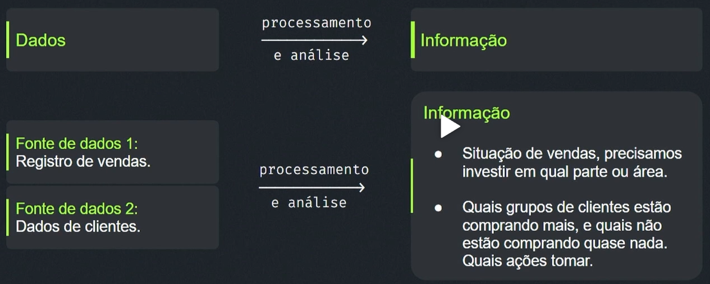
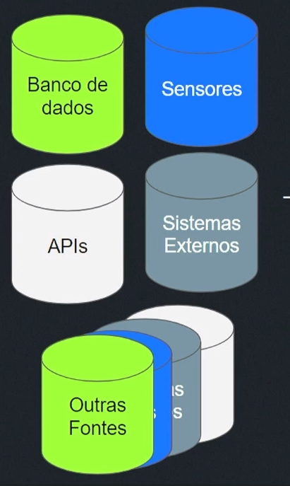
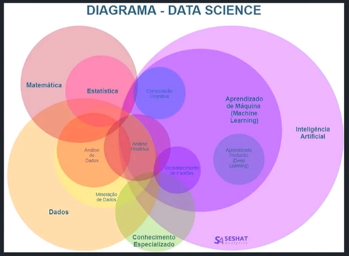
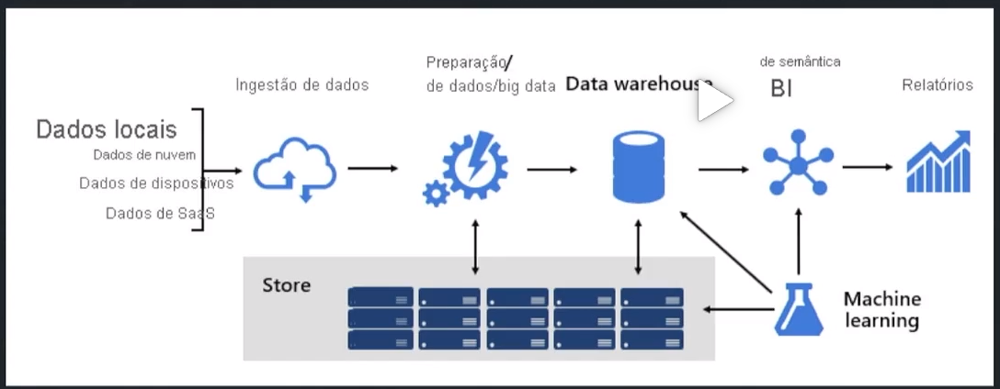
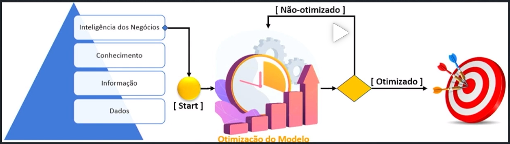
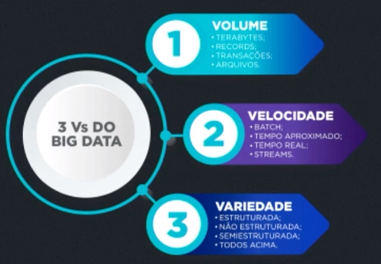
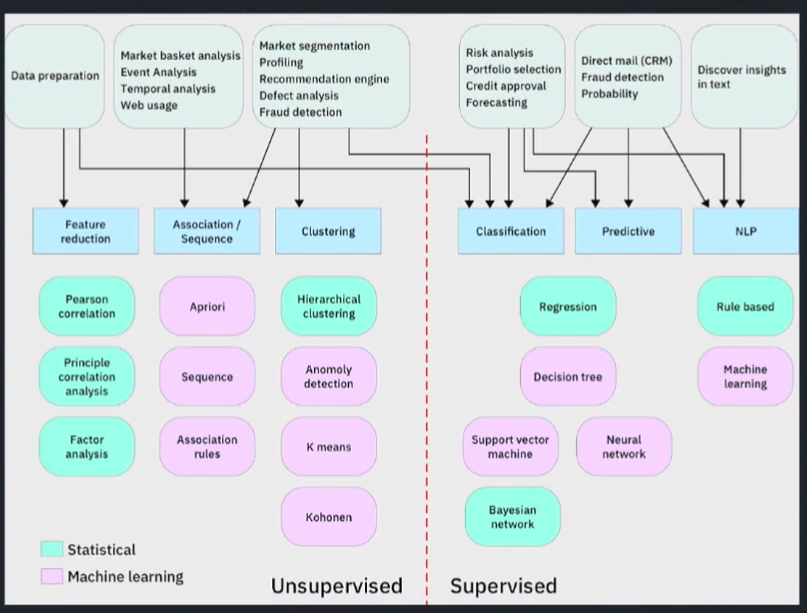

# Qual é a diferença entre dados e informação

## Dados
* São elementos coletados e armazenados em  sua forma bruta, sem nenhum processamento e análise.
* Podem ser tabelas, imagens textos, entre outros tipos e formatos.

## Informação
* Dados processados e analisados que geram valor, conhecimentok e ajudam na tomada de decisão.

## Exemplo

## Quais são os profissionais envolvidos nesse mundo dos dados?
### Engenheiro de dados
Responsável por coletar, organizar e preparar diferentes tipos de dados a partir de diferentes fontes de dados.

### Cientista de dados
Responsável por desenvolver modelos estatísticos e algoritmos avançados para descobrir insights valiosos e prever tendências futuras.

### Analista de Dados
Responsável por usar ferramentas e técnicas para organizar, limpar e visualizar os dados de maneira clara e compreensível.

### Engenheiro de MLOps
Implementa e gerencia os modelos avançados (criados pelo cientísta de dados) garantindo a melhor eficiência na operação do dia-a-dia.

### Engenheiro de DevOps
Suporta todos os profissionais na automação e facilitação dos processos e softwares.

# O que faz um engenheiro de dados?

A primeira responsabilidade destacada é a ingestão de Dados.

## 1 - Ingestão de dados
Coleta de dados de diversas fontes, incluindo bancos de dados, APIs, sistemas externos, entre outras fontes.

## Tipos de ingestão de dados

### Ingestão por lotes:
Coleta de dados em lotes, geralmente em intervalos pré-determinados. Como por hora, minutos, dia e etc.

### Ingestão com streaming:
Coleta de dados em tempo real, à medida que são gerados.

## 2 - Limpeza e preparação de dados
Tratamento dados para garantir qualidade, consistência e integridade, utilizando técnicas como **ETL (Extract, Transform, Load)** ou **ELT (Extract, Load, Transform)**. 

### ETL - Extract, Transform, Load

### ELT -Extract, Load, Transform

## 3 - Modelagem de dados e definição de arquteturas de dados
Definir a melhor estrutura e definir o melhor relacionamento entre as entidades trabalhadas.

## 4 - Gerenciamento e governança de dados
Governança de dados é a gestão de dados na esfera de alto nível. É o conjunto de políticas, processos e estrutura organizacional que embasam e norteiam o gerenciamento de dados corporativos. A governança de dados ajuda a estabelecer processos de gerenciamento de dados que mantêm seus dados seguros, privados, precisos e utilizáveis em todo o ciclo de vida dos dados. É um conjunto de ações que contribuem para a tomada de decisões assertivas, reforçando a estratégia da empres

## 5 - Documentação, comunicação e colaboração com outros times
A documentação correta dos projetos é muito importante para garantir que todas as informacões coletadas e tratadas estejam em um padrão e que estejam disponíveis para todos os interessados no processo.

# O que faz um cientísta de dados

## Quais as principais responsabilidades de uma pessoa cientista de dados?
A primeira responsabilidade destacada é a Análise Exploratória de Dados.

## 1 - Análise Exploratória de Dados
Analisar os dados da empresa / negócio e produzir informações, conhecimentos para tomadas de decições como também produzir conhecimento para determinada área de estudo. Produção de informação.
## 2 - Desenvolvimento de modelos.
Desenvolvimento de modelos, como modelos estatísticos, modelos de machine learning, entre outros.

## 3 - Integração de modelos com outros sistemas.

Após o modelo ser definido, é preciso implementar e integrar o mesmo aos sistemas do negócio.

## 4 - Otimização de Desempenho
Dados são dinâmicos e seus cenário mudarão frequentemente, por isso é necessário realizar sempre uma otimização ao longo do tempo. Encontrar de forma contínua a melhor forma de se trabalhar com os dados.

## 5 - Documentação, comunicação e colaboração com outros times
É preciso escrever uma documentação clara de forma que os outros times, internos e externos, possam entender as ferramentas construídas e métricas utilizadas, garantindo o dinamismo e funcionamento do negócio.
Comunicação e colaboração também são muito importantes pois ajuda na eficiência dos trabalhos com outras equipes, deixando as atividades mais dinâmicas e funcionais.

# Os cincos principais desafios enfrentados na engenharia de dados
O primeiro desafio destacado é o volume, a variedade e a velocidadde no processamento de dados.

## 1 - Volume, a variedade e a velocidadde no processamento de dados

### Os 3 Vs do BIG DATA

* **Volume**:  TeraBytes, Records, Transações, Arquivos.
* **Velocidade**: Batch, Tempo Aproximado, Tempo Real, Streams.
* **Variedade**: Estruturada, Não Estruturada, SemiEstruturada, Todos.

## 2 - Qualidades dos Dados

## 3 - Manutenção e o Monitoramento dos Processos

Garantir que todos os processos, sistemas e estruturas sempre estejam funcionando, com garantia de qualidade e melhores práticas possíveis

## 4 - Segurança e privacidade dos dados

Os dados tanto de pessoas e empresas são bens valiosos, deve -se manter o controde de acesso e manipulação dos dados. Garantir a melhor segurança possível.

LGPD - conhecer bem a lei e entender tudo que se faz e fará com os dados
Legislação precisa ser seguida

## 5 - Escalabilidade e tecnologias em evolução

Garantir e entender quais são as melhores tecnologias, melhores formas de implementação. Juntar escalabilidade com as tecnologias disponíveis e que estão sempre evoluindo.

# Os cincos principais desafios encontrados na ciência de dados.
## Quais os princiapais desafios de uma pessoa Cientista de Dados?

## 1 - Compreensão do Domínio

O time de ciência de dados precisa estar alinhado e com uma boa compreensão  do domínio da área de estudo e negócio. É muito importante o time tentar compreender e assimilar sobre a área de estudo.

## 2- Seleção e escolah de modelos e algoritmos

Fazer o processo de estudo científico para buscar entender e escolher o melhor modelo para o negócio

## 3 - Interpretabilidade e Precisão

## 4 - Escalabilidade e Infraestrutura

No projeto de uma nova solução, é preciso pensar na escalabilidade e ao mesmo tempo, pensar na infra-estrutura por trás que permitirá que essa solução seja possível.

## 5 - Comunicação e colaboração

Promover um ambiente em que o time se torne mais colaborativo, ambiente acessível a todos. Garantir melhor comunicação.

