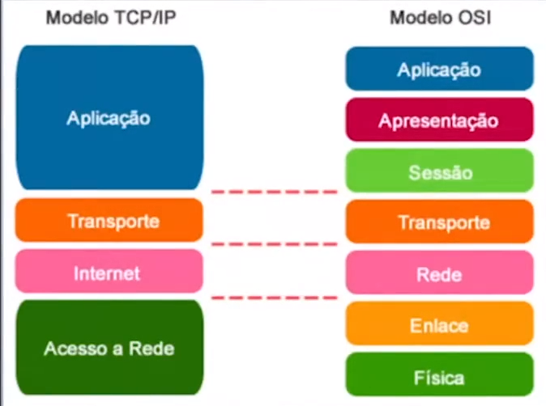
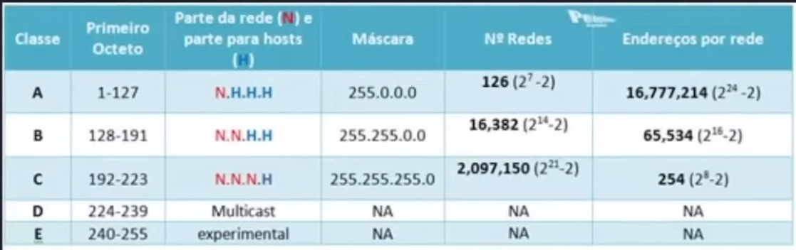
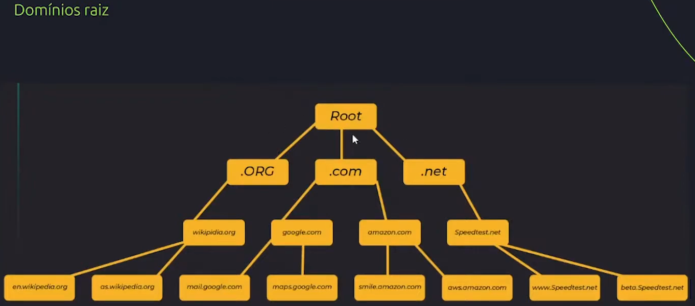
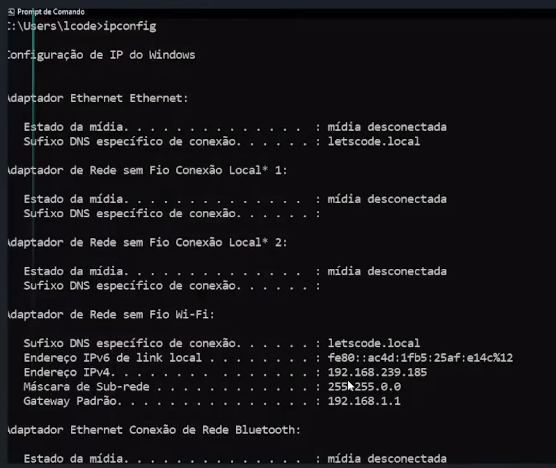
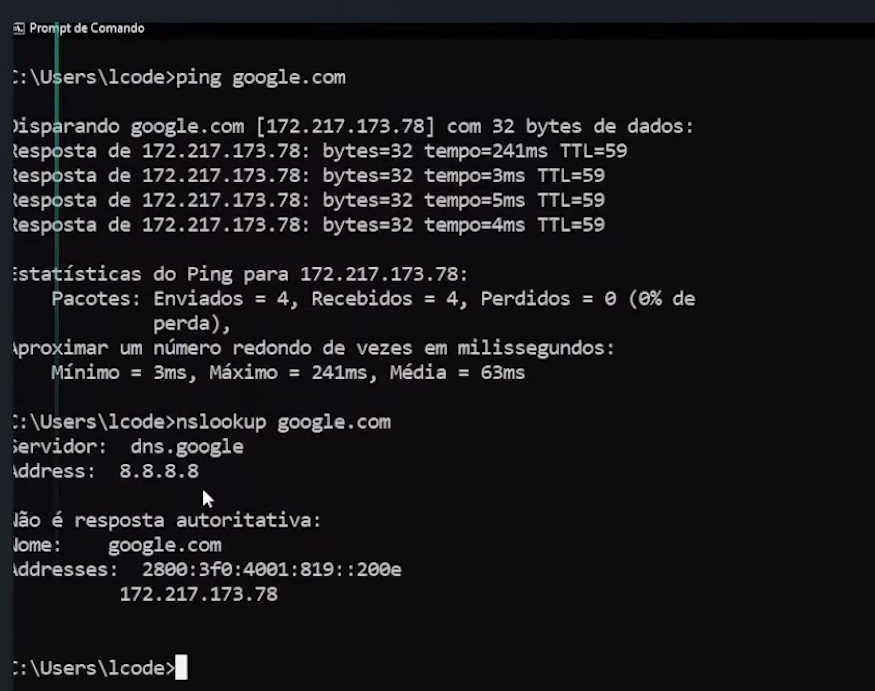
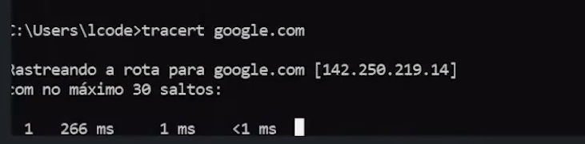
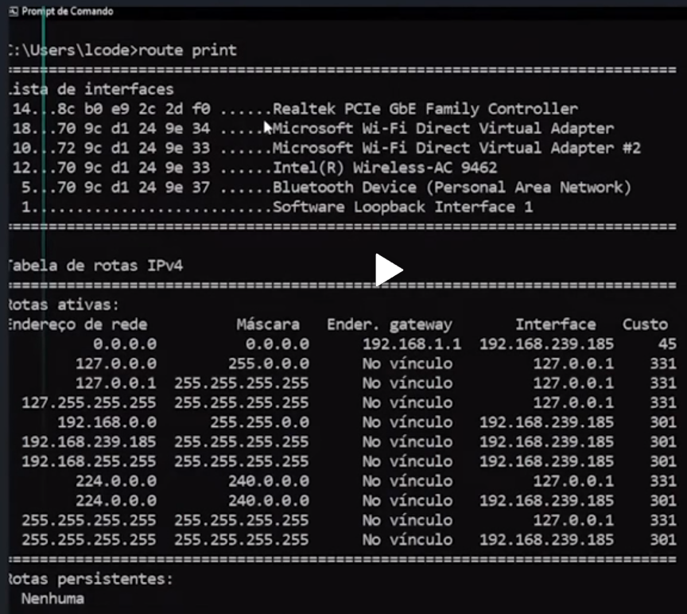

# Redes


## Modelo OSI / TCP-IP



Acesso é de baixo pra cima
### MODELO OSI 
#### Mais próximo do usuário.
* **Aplicaçao**: Mais próxima do usuário, protocolos DNS, SSH
* **Apresentação**: Criptografia, conexão segura, pesistente. Responsável por criptografar os dados para a camada de sessão e também descriptografar os dados de volta para camada de Aplicação.
* **Sessão**: Responsável por estabelecer uma sessão entre origem e destino final. Como vai ser a forma de transmissão.

#### Mais a nível de hardware
* **Transporte**: Responsável também pela conexao com destino final através dos protocolos **TCP**, e **UDP**.
    
    * **TCP**:  Envia os dados para o destino final (segmento), garante a entrega. Ex(email,transações bancárias)
    * **UDP**: Envia os dados sem garantir a entrega. (Serviços de Streams de musica e vídeos).

* **Rede**: Recebe o segmento da camada de transporte e transforma em um pacote onde acontece o envio e recebimento de um roteador para outro.

* **Enlace**: Responsável por fragmentar os pacotes recebidos da camada de rede e transformá-los em quadros. Responsável por fazer a comunicação por endereços MAC.

* **Física**: Parte física da rede, cabos, switchs, placas, protocolos.

### MODELO TCP/IP
 Só muda a segmentação
* **Aplicação**: camadas de aplicação, apresentação e sessão do modelo OSI

* **Transporte**: Camada de transporte do modelo OSI.

* **Internet**: Camada de rede do modelo OSI.

* **Acesso a Rede**: Camadas de Enlace e Física do modelo OSI.

--------------------------------------------------------------
## IPv4 E IPv6

### IP - Internet Protocol
O termo IP (nternet Protocol) é o protocolo responsável pelo endereçamento dos pacotes de rede na camada 3 do modelo OSI, ou seja, é responsável por gerar um endereço ao seu computados, ou qualquer servidor, no momento que este conecta-se à internet. Atualmente existem dois formatos que são: **IPv4 e IPv6**.

**IPv4**: 192.168.0.1
--------------------------------------------------------------
Formato de 32 bits divididos em 8 octetos onde cada octeto pode variar de 0 até 255.
Criado na década de 80 e muito utilizado até hoje. Quando criado, a estimativa era que o IPv4 podesse receber até 4 bilhões de dispositivos, e esse limite chegou. Não tendo mais endereços ipv4 disponíveis. Para resolver esse problema foi criado o **NAT** (**Protocolo utilizado para permitir comunicação entre dispositivos com diferentes endereços IP**) que de forma mais simples, é responsável por converter Ips públicos emprivados e vice-versa.

**IPv6**: 1050:0000:0000:0000:0005:0600:300f:326b(11050:0:0:0:5:600:300c:326b)
-------------------------------------------------------------- 
Formato de 128 bits dividido em 16 pares. É a evolução do IPv4, em formato hexadecimal, sua utilização veio para resolver o problema da escasez de IPv4. Ainda não está muito presente no nosso dia-a-dia.

## CÁLCULO DE SUB-REDE



Calculadora de sub rede: https://www.site24x7.com/pt/tools/ipv4-sub-rede-calculadora.html

O que é uma sub -rede

Todo endereço IP tem uma **máscara** correspondente. Essa máscara que identifica qual parte do endereço pertence a rede e qual parte ao host.
Exemplo: Em um endereço 192.168.1.27 com máscara 255.255.255.0, identifica como parte da rede o endereço 192.168.0 e o host como 27.

Para dividir essa rede, nós podemos dividir essa máscara. Para isso podemos usar valores diferetes entre 0  e 255. Quando fazemos isso, damos o nome de sub-rede.

## Calculando as máscaras de sub-rede

Cada três dígitos na máscara, correspondem a uma parte do endereço IP do host. Essas partes são formadas por oito bits, por isso recebem o nome de octetos.

Cada bit no octeto, possui um valor em decimal correspondente a sua posição.

Por serem bits, só possuem dois estados, 0(zero) representando o host, ou 1 representando a rede.

No caso da máscara 255.255.255.0, pode ser representada em binário como:
(255.255.255.0 = 11111111.11111111.11111111.00000000)


## Criado sub-redes

Como foi visto, os bits 1 na máscara especificam a porção da rede e os bits 0 especificam o host no endereço IP. Para criar nossas redes, podemos pegar alguns bits0 e transformá-los em 1.

Por exemplo, se pegarmos o primeiro bit 0 na máscara e transformá-lo em 1, teríamos a seguinte máscara em binário.

(11111111.11111111.11111111.10000000)

E para saber-mos como ficaria sua máscara em decimal, devemos fazer a conversão de binário para decimal.

2 ^ 7 = 128 

2 ^ 6 = 64

2 ^ 5 = 32

2 ^ 4 = 16

2 ^ 3 = 8

2 ^ 2 = 4

2 ^ 1 = 2

2 ^ 0 = 1


|1|0|0|0|0|0|0|0|
|----|----|----|----|----|----|----|----|
|128 | 64 | 32 | 16 | 8 | 4 | 2 | 1 |


Portanto a máscara binária 
(11111111.11111111.11111111.10000000)

Em decimal fica:
255.255.255.128

### Quantas redes podemos ter com essa máscara?

Para sabermos o números de redes basta elevar a 2 o bit da proção host
2 ^ 1 = 2,
portanto duas redes.

e quantos host cada rede deve comportar?
Eleva-se a 2, os bits 0 restantes da máscara, nesse caso 
2 ^ 7 = 128

portanto cada uma das redes pode ter 128 host.
Entre esses 128 host, dois precisam ser reservados, um para especificar a rede e o outro para especificar o broadcast, broadcast é o host utilizado para fazer a comunicação simultânea entre todos os host da rede.

Portanto em uma rede de máscara 255.255.255.128, temos na verdade 126 host disponíveis em cada sub-rede.

### E se fosse necessário obter mais redes?

Podemos pegar os bits 0 da máscara e transformá-los em 1, por exemplo, na mascara que agora é 255.255.255.128 e em binário é: 
(11111111.11111111.11111111.**10000000**)
no seu último octeto **1 0 0 0 0 0 0 0**, transformando o próximo bit 0 em 1 teríamos uma mascara: **1 1 0 0 0 0 0 0**
que em decimal ficaria: **255.255.255.192**. 192 pois conforme a tabela de conversão de binário para decimal, teríamos: 

|1|1|0|0|0|0|0|0|
|----|----|----|----|----|----|----|----|
|128 | 64 | 32 | 16 | 8 | 4 | 2 | 1 |

Dois bits 1:  2 ^ 7 + 2 ^ 6 = 192.

### Quantas redes teríamos com essa máscara?

Quando pegamos um bit da máscara, obtivemos 2 redes, portanto, pegando 2 bit, é só elevar a 2 e teremos 2 ^ 2 = 4 redes disponíveis com essa máscara.

### E quantos hosts teremos em cada sub-rede?

Basta elevar 2 ao numero de bits 0 restantes do ultimo octeto e subtrair 2

numero de hosts = (2 ^ bits 0) - 2

Logo na mascara 255.255.255.192 teremos:

numero de hosts = (2 ^ 6) - 2 = **62 hosts em cada rede**.

### Como fica distribuído o endereço de cada rede?
Numa rede de ip: **192.168.0.0**

O endereço da primeira sub-rede será exatamente 192.168.0.0, já o seu broadcast será 1 + o número de hosts da rede mais o endereço da rede, nesse caso 1 + 62 + 0, ou seja, 192.168.0.63.

A segunda sub-rede será então: 192.168.0.64. seu broadcast será, 1 + 62 + 64, ou seja,  192.168.0.126

A terceira sub-rede será 192.168.0.127 com broadcast 192.168.0.190

E por fim a quarta sub-rede 192.168.0.191 com broadcast 192.168.0.255

# DOMÍNIO, DNS E LATÊNCIA

## DNS - Domain Name Sistem


### Top level domain



## Latência
 Tempo de duração de uma requisição da origin até o destino.

 # Principais comando utilizados em redes de configuração

 ## Windows

 No linux [clique aqui](https://livreeaberto.com/comandos-basicos-de-rede-no-linux)

 
$ ipconfig: principais configurações de ip no windows

```prompt
ipconfig
```



$ **flushdns**: Limpar cache dns, zerar dns

```prompt
ipconfig/flushdns
```
$ **ping**: protocolo icmp, verifica conexão.
```prompt
ping google.com
```

$ **nslookup**: Verifica se foi um endereço ip
```prompt
nslookupng google.com
```


$ **tracert**: Mapear quantos saltos de roteador trassa da requisição da origem até o destino.

$ **nslookup**: Verifica se foi um endereço ip
```prompt
tracert google.com
```


$ **route print**: exibe as tabales de roteamento IPv4 e IPv6



$ netstat: Mapea as portas utilizadas pelo computador

# SEGURANÇA 
* **Segurança Física**: Onde estão seus equipamentos, localização, prevenção de perdas e furtos, BackUps, Reduntância, atualizações.

* **Segurança Lógica**: Single sign-on, implementação de FireWall, Conexões VPN, 

## Tipos de Ataques
* **DoS**: Multi solicitações local
* **DDoS**: O ataque DDoS envia múltiplas solicitações para o recurso Web invadido com o objetivo de exceder a capacidade que o site tem de lidar com diversas solicitações, impedindo seu funcionamento correto.
* **Ransomware**: Ransomware é um tipo de ataque virtual que criptografa os dados de um computador infectado, impedindo que eles possam ser acessados.

# Wireless