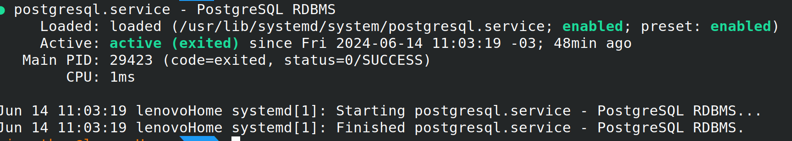
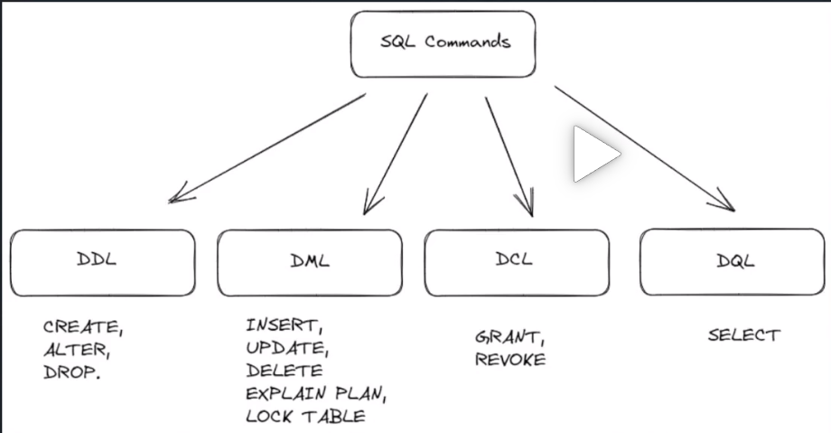

# SQL
## INSTALL POSTGRESQL PSQL LINUX UBUNTU

Ubuntu includes PostgreSQL by default. To install PostgreSQL on Ubuntu, use the apt (or other apt-driving) command:
```BASH
apt install postgresql
```

PostgreSQL Apt Repository

```bash
sudo apt install -y postgresql-common
sudo /usr/share/postgresql-common/pgdg/apt.postgresql.org.sh
```
## Installing pgAdmin 4 on Ubuntu

1. Add pgAdmin4 repository
The pgAdmin packages for all Debian based Linux operating systems are available from the pgAdmin APT repository. In this step we will add the repository to our Ubuntu system.
curl  -fsSL https://www.pgadmin.org/static/packages_pgadmin_org.pub | sudo gpg --dearmor -o /etc/apt/trusted.gpg.d/pgadmin.gpg
Use the next command given to add pgAdmin repository in your Ubuntu system:
sudo sh -c 'echo "deb https://ftp.postgresql.org/pub/pgadmin/pgadmin4/apt/$(lsb_release -cs) pgadmin4 main" > /etc/apt/sources.list.d/pgadmin4.list'
You can check the contents of the repository file created using the following command:
```bash
$ cat /etc/apt/sources.list.d/pgadmin4.list
deb https://ftp.postgresql.org/pub/pgadmin/pgadmin4/apt/bullseye pgadmin4 main
```

2. Install pgAdmin4 on Ubuntu
Finally, update the package lists.
```bash
sudo apt update
```

To install pgAdmin4 packages on Ubuntu 22.04|20.04|18.04 system, run these commands, providing correct version number:
```bash
sudo apt install pgadmin4
```
Hit the y key to continue with the installation ofpgAdmin4 on Ubuntu 22.04|20.04|18.04.

```bash
....
  cpp-doc gcc-9-locales libdigest-hmac-perl libgssapi-perl libcrypt-ssleay-perl lm-sensors libauthen-ntlm-perl libunicode-map8-perl libunicode-string-perl xml-twig-tools postgresql-12
  postgresql-doc-12 mesa-utils nickle cairo-5c xorg-docs-core
The following NEW packages will be installed:
  cpp cpp-9 fontconfig-config fonts-dejavu-core gcc-9-base libapache2-mod-wsgi-py3 libatomic1 libauthen-sasl-perl libdata-dump-perl libdrm-amdgpu1 libdrm-intel1 libdrm-nouveau2 libdrm-radeon1
  libencode-locale-perl libfile-basedir-perl libfile-desktopentry-perl libfile-listing-perl libfile-mimeinfo-perl libfont-afm-perl libfontconfig1 libfontenc1 libgl1 libgl1-mesa-dri libglapi-mesa
  libglvnd0 libglx-mesa0 libglx0 libhtml-form-perl libhtml-format-perl libhtml-parser-perl libhtml-tagset-perl libhtml-tree-perl libhttp-cookies-perl libhttp-daemon-perl libhttp-date-perl
  libhttp-message-perl libhttp-negotiate-perl libice6 libio-html-perl libio-socket-ssl-perl libio-stringy-perl libipc-system-simple-perl libisl22 libllvm12 liblwp-mediatypes-perl
  liblwp-protocol-https-perl libmailtools-perl libmpc3 libnet-dbus-perl libnet-http-perl libnet-smtp-ssl-perl libnet-ssleay-perl libpciaccess0 libpq5 libsensors-config libsensors5 libsm6
  libtie-ixhash-perl libtimedate-perl libtry-tiny-perl liburi-perl libvulkan1 libwayland-client0 libwww-perl libwww-robotrules-perl libx11-protocol-perl libx11-xcb1 libxaw7 libxcb-dri2-0
  libxcb-dri3-0 libxcb-glx0 libxcb-present0 libxcb-randr0 libxcb-shape0 libxcb-shm0 libxcb-sync1 libxcb-xfixes0 libxcomposite1 libxcursor1 libxfixes3 libxft2 libxi6 libxinerama1 libxkbfile1
  libxml-parser-perl libxml-twig-perl libxml-xpathengine-perl libxmu6 libxpm4 libxrandr2 libxrender1 libxshmfence1 libxt6 libxtst6 libxv1 libxxf86dga1 libxxf86vm1 mesa-vulkan-drivers
  perl-openssl-defaults pgadmin4 pgadmin4-desktop pgadmin4-server pgadmin4-web postgresql-client postgresql-client-12 postgresql-client-common x11-common x11-utils x11-xserver-utils xdg-utils
0 upgraded, 110 newly installed, 0 to remove and 6 not upgraded.
Need to get 222 MB of archives.
After this operation, 508 MB of additional disk space will be used.
Do you want to continue? [Y/n] y

```
Apache service should have been started after installation.

```bash
$ systemctl status apache2
● apache2.service - The Apache HTTP Server
     Loaded: loaded (/lib/systemd/system/apache2.service; enabled; vendor preset: enabled)
     Active: active (running) since Fri 2023-06-16 12:21:28 UTC; 15s ago
       Docs: https://httpd.apache.org/docs/2.4/
    Process: 22562 ExecStart=/usr/sbin/apachectl start (code=exited, status=0/SUCCESS)
   Main PID: 22566 (apache2)
      Tasks: 55 (limit: 18678)
     Memory: 15.5M
        CPU: 204ms
     CGroup: /system.slice/apache2.service
             ├─22566 /usr/sbin/apache2 -k start
             ├─22568 /usr/sbin/apache2 -k start
             └─22569 /usr/sbin/apache2 -k start

Jun 16 12:21:28 jammy systemd[1]: Starting The Apache HTTP Server...
Jun 16 12:21:28 jammy systemd[1]: Started The Apache HTTP Server.
```
3. Configure Apache web server for pgAdmin4
Initiate Apache web server configuration.
```bash
sudo /usr/pgadmin4/bin/setup-web.sh
```
This will require you to input pgadmin4 user email address and set the password:
```bash
Setting up pgAdmin 4 in web mode on a Debian based platform...
Creating configuration database...
NOTE: Configuring authentication for SERVER mode.

Enter the email address and password to use for the initial pgAdmin user account:

Email address: <input-email-address>
Password: <input-password>
Retype password: <Reenter-password>
pgAdmin 4 - Application Initialisation
======================================

Creating storage and log directories...
```
Agree for the configuration of Apache Web server.
```bash
We can now configure the Apache Web server for you. This involves enabling the wsgi module and configuring the pgAdmin 4 application to mount at /pgadmin4. Do you wish to continue (y/n)? y
The Apache web server is running and must be restarted for the pgAdmin 4 installation to complete. Continue (y/n)? y
Apache successfully restarted. You can now start using pgAdmin 4 in web mode at http://127.0.0.1/pgadmin4
```
4. Access pgAdmin 4 Web interface
If you have UFW firewall configured, allow http and https traffic.
```bash
sudo ufw allow http
sudo ufw allow https
```
Open your browser and http://[ServerIP_or_domain]/pgadmin4.

## [How to Install PostgreSQL and pgAdmin Tool on Debian 12](https://www.howtoforge.com/how-to-install-postgresql-and-pgadmin-tool-on-debian-12/)

## Prerequisites
* A Debian 12 server.
* A non-root user with administrator privileges.

First, execute the following command to add the PostgreSQL repository for your Debian system.

```bash
sudo sh -c 'echo "deb [arch=amd64 signed-by=/usr/share/keyrings/pgdg.gpg] http://apt.postgresql.org/pub/repos/apt $(lsb_release -cs)-pgdg main" > /etc/apt/sources.list.d/pgdg.list'
```

Then add the GPG key of the PostgreSQL repository.

```bash
curl -fsSL https://www.postgresql.org/media/keys/ACCC4CF8.asc | sudo gpg --dearmor -o /usr/share/keyrings/pgdg.gpg
```

Now execute the following update on your available repositories and get the latest package information.

```bash
sudo apt update
```

Install the latest version of the PostgreSQL server via the apt install command below. Type y to confirm the installation and proceed.
```bash
sudo apt install postgresql
```

After PostgreSQL is installed, run the following systemctl command to ensure that the postgresql service is running.

```bash
sudo systemctl is-enabled postgresql
sudo systemctl status postgresql
```

The following output indicates that the postgresql service is running and enabled, and it will start automatically at system boot.



## ACESS POSTGRESQL SHELL

Execute the psql following command to access the PostgreSQL shell.

```bash
sudo -u postgres psql

# -u = user
# postgres = user name
# psql = postgresql
```

## CHANGE POSTGRES DEFAULT PASSWORD 
Now run the following query to change the password for the PostgreSQL default user postgres. Be sure to change the password in the following query.
```sql
ALTER USER postgres WITH PASSWORD 'p4ssw0rdAdmin';
-- Change p4ssw0rdAdmin for yours!
```

## Creating PostgreSQL User and Database via psql
In the following section, you will learn how to create a PostgreSQL user and database via PostgreSQL shell (psql). The psql is a client tool for interacting and managing the PostgreSQL server from the terminal, and it's installed by default during the PostgreSQL server installation.


Now execute the following queries to create a new PostgreSQL user and password. In this example, you will create a new user alice with password p4ssw0rd.

```sql
CREATE USER alice with CREATEDB CREATEROLE;
ALTER USER alice with PASSWORD 'p4ssw0rd';
```

Verify the list of available users on PostgreSQL using the following query. If successful, you should see the user alice created.

```sql
\du
```
Next, run the following query to create a new database alice with the owner alice. Then, verify the list of available databases on your PostgreSQL server.

```sql
CREATE DATABASE alice OWNER alice;
\l
```
## SUBCONJUNTOS - SQL COMMANDS



## DDL - Data Definition Language
 engloba os comandos de definição do banco de dados. Interagem com os objetos do banco. São eles: 

* **CREATE**: De modo geral, o comando Create cria objetos. Pode ser usado para criar desde novos bancos de dados completamente zerados a tabelas específicas. No exemplo, estamos criando uma tabela para os dados de estudantes.

```sql
CREATE TABLE estudantes;
```

* **DROP**: O comando Drop exclui objetos do banco de dados. Essa remoção de tabelas envolve todas as linhas, privilégios e índices. Na aplicação, o drop não necessita de nenhuma cláusula adicional.

```sql
DROP DATABASE unidade_centro;
```

* **ALTER**: O ALTER altera objetos já existentes, seja modificando, excluindo ou adicionando. No exemplo a seguir, alteramos a tabela estudantes excluindo a coluna nome. No mesmo caso, vemos também o uso do DROP.

```sql
ALTER TABLE estudantes
DROP COLUMN nome;
```
* **RENAME**: É um comando bastante simples, sua função é renomear objetos. Na sintaxe, é preciso citar qual objeto sofrerá a alteração e qual será o novo nome.

```sql
RENAME TABLE estudantes TO alunos;
```
Temos também as opções:

* **COMMENT**
É uma função usada para fazer um comentário explicativo ou impedir a execução de uma linha de SQL pelo sistema. Esse princípio, a possibilidade de fazer comentários, é comum a outras linguagens de programação, representado por diferentes símbolos. 

Existem duas opções de COMMENT no SQL: simbolizado por dois traços ( — ), estando tudo posterior a eles na linha automaticamente anulado na execução do código, ou por meio da utilização de um asterisco e uma barra (/*), que necessita ser aberto antes do início do comentário, e fechado, após o fim deste. O primeiro, de dois traços, é usado para comentários de apenas uma linha. O segundo, o comentário multilinhas, para aqueles com duas ou mais. Vejamos exemplos:

```sql
-- atencao para aniversario
 
 
/* Dois estudantes comemoram aniversario em data diferente da que foram registrados */
```

* **TRUNCATE**:
Exclui todo o conteúdo de uma tabela e redefine sua identidade para o valor inicial. Essa exclusão envolve também os espaços destinados aos registros. Trata-se de uma operação que não pode ser revertida.

## DQL- Data Query Language
é o subconjunto responsável por comandos de consulta aos dados armazenados. Dentro dele, encontramos apenas o comando **Select**. É importante observar que em alguns materiais acadêmicos essa instrução aparece incorporada no conjunto DML, que veremos mais a seguir.

* **SELECT**: Esse comando é um dos mais importantes da SQL, pois é ele quem possibilita a consulta a dados de uma tabela. De modo geral, o Select recupera dados de determinado lugar. Os dados recuperados pelo Select são armazenados em uma nova tabela, chamada conjunto de resultados. É um comando que tem a possibilidade de ser estruturado de forma a fazer consultas mais simples ou mais complexas.

```sql
SELECT aniversario FROM estudantes;
```


## DML - Data Manipulation Language
Corresponde aos comandos de manipulação dos dados. Composta de apenas três comandos, envolve interações de armazenamento, modificação, exclusão, inserção e atualização.

* **INSERT**: Essa instrução insere dados a uma ou mais tabelas. Na sua estrutura, deve ser acompanhada de INTO. Vejamos um exemplo:

```sql
INSERT INTO estudantes (matricula, nome, aniversario) values (1776, Joana, 21 abr. 1987);
```
* **UPDATE**: Atualiza os dados existentes em uma ou mais tabelas. Deve ser usado com a cláusula WHERE, para que se saiba em que linha será a atualização dos dados. Caso seja utilizado sem o WHERE, atualiza todos os registros. Como exemplo do segundo caso:
```sql
UPDATE estudantes;
```

* **DELETE**: Exclui os registros de uma tabela ou mais. Quando não acompanhado de uma cláusula, todas as linhas são removidas.
```SQL
DELETE FROM estudantes WHERE matricula = 1776;
```
## DCL - Data Control Language
Esse subconjunto do SQL envolve comandos relacionados à segurança do banco de dados. A DCL  controla o acesso aos dados, tanto concedendo privilégio de acesso, quanto retirando a permissão do usuário ou usuária. 
* **GRANT**: Fornece a determinada pessoa o privilégio de acesso dentro do banco de dados. No exemplo a seguir, estamos permitindo a Luiz consultar os dados da tabela estudantes.
```SQL
GRANT SELECT ON estudantes TO Luiz;
```

* **REVOKE**: Esse comando retira os privilégios de acesso. Ou seja, faz a operação inversa ao GRANT, negando a permissão. A seguir, vamos desfazer o que fizemos com GRANT. Para isso, utilizaremos o FROM.
```SQL
REVOKE SELECT ON estudantes FROM Luiz;
```


## DTL ou TCL: linguagem de transação de dados

A DTL ou TCL (Data Transaction Language) é um subconjunto do SQL para transação de dados. A DTL envolve gerenciamento e controle de transações. 

* **BEGIN/SET TRANSACTION**: 
Tanto o comando BEGIN TRANSACTION quanto o SET TRANSACTION indicam o início de uma transação. Devem ser usados imediatamente no começo do código, registrando que tudo que vem abaixo faz parte da mesma transação. A diferença entre BEGIN TRANSACTION e SET TRANSACTION está que na segunda pode-se atribuir especificações a respeito daquela transação, como, por exemplo, se será apenas para leitura. 

* **COMMIT**:
Se a instrução BEGIN/ SET TRANSACTION inicia uma transação, a COMMIT a finaliza. O comando indica o fim de cada transação, salvando o que foi feito na transação atual. O COMMIT aparece no final daquela transação em específico, fechando o que foi aberto pelo BEGIN/SET TRANSACTION.

A seguir, vejamos um exemplo de início e fim de uma transação, usando os comandos BEGIN TRANSACTION e COMMIT.
```SQL
BEGIN TRANSACTION
DELETE FROM estudantes WHERE matricula = 1776;
COMMIT;
ROLLBACK
```
O comando **Rollback** reverte uma transação. Na prática, restaura o banco de dados desde a última vez que o comando COMMIT foi aplicado, garantindo apenas até onde as alterações já foram salvas. É um comando crucial, que pode ser usado em situações de erro.

* **SAVEPOINT**: 
O SAVEPOINT define um ponto de salvamento dentro de uma transação, funciona como um “ponto de segurança”. Tudo que é anterior a ele não pode ser descartado com o comando ROLLBACK, apenas o que vem após. 

## COMANDOS PSQL TERMINAL

```sql
-- Listar Database
\l

--sair psql
 \q

-- Conectar a um Database
\c nome_do_banco 

```

## COMANDOS DLL
```sql
-- cria um novo banco de dados
CREATE DATABASE nome do banco

-- criar schema
```

## Criar schema

O que são Schemas?

Os Schemas são uma coleção de objetos dentro de um determinado database (banco de dados), servem para agrupar objetos no nível de aplicação como também para simplesmente fazer divisões departamentais. Schemas são bastante utilizados em padrões de sistema de banco de dados. São muito importantes para a performance e segurança.


```sql
-- criar schema
CREATE SCHEMA study;
```

## Criar Tableas

```sql
CREATE TABLE  study.instrutores ( -- create table schema.nome_da_tabela
	id SERIAL PRIMARY KEY, 
	nome VARCHAR(50) NOT NULL, 
	email VARCHAR(50) NOT NULL, 
	valor_hora INTEGER NULL, 
	certificados VARCHAR(50)
	);
```

# Comandos utilizados na aula

```sql
CREATE TABLE  study.instrutores (
	id SERIAL PRIMARY KEY, 
	nome VARCHAR(50) NOT NULL, 
	email VARCHAR(50) NOT NULL, 
	valor_hora INTEGER NULL, 
	certificados VARCHAR(50)
	);

CREATE TABLE study.cursos (
	id serial PRIMARY KEY,
	nome VARCHAR(50) NOT NULL,
	requesito VARCHAR(255) NULL,
	carga_horaria SMALLINT NULL,
	preco DOUBLE PRECISION NULL
);

SELECT * FROM study.cursos;

CREATE TABLE study.alunos(
	id SERIAL PRIMARY KEY,
	cpf CHAR(11) NOT NULL,
	nome VARCHAR(50) NOT NULL,
	email VARCHAR(30) NOT NULL,
	fone CHAR(14) NOT NULL,
	data_nascimento DATE NULL
);

SELECT * FROM study.alunos;

CREATE TABLE study.turmas(
	id SERIAL PRIMARY KEY,
	instrutores_id INT NOT NULL,
	cursos_id INTEGER NOT NULL,
	data_inicio DATE,
	data_FIM DATE,
	carga_horaria SMALLINT,
	FOREIGN KEY (cursos_id)
	REFERENCES study.cursos(id),
	FOREIGN KEY (instrutores_id)
	REFERENCES study.instrutores(id)
);

select * from study.turmas;

CREATE TABLE study.matriculas(
	id SERIAL PRIMARY KEY,
	turmas_id INTEGER NOT NULL,
	alunos_id INTEGER NOT NULL,
	data_matriculado DATE NULL,
	CONSTRAINT fk_turmas_id
	FOREIGN KEY (turmas_id)
	REFERENCES study.turmas(id),
	CONSTRAINT fk_alunos_id
	FOREIGN KEY (alunos_id)
	REFERENCES  study.alunos(id)
);


```

## COMANDOS DDL (ALTER, DROP)

```sql
ALTER TABLE study.alunos RENAME TO aluno_ada; -- alterar nome de tabelas

ALTER TABLE study.aluno_ada RENAME nome TO nome_aluno; --alterar nome de coluna

ALTER TABLE study.aluno_ada ADD teste INT; -- adicionar coluna

ALTER TABLE study.aluno_ada ALTER COLUMN teste TYPE VARCHAR(50); -- alterar o tipo de uma coluna

-- COMANDO DROP

ALTER TABLE study.aluno_ada DROP COLUMN teste; --deleta coluna

-- Mudar SCHEMA de uma tabela

ALTER TABLE study.aluno_ada SET SCHEMA teste;

DROP TABLE teste.aluno_ada; -- deleta a tabela


```

## COMANDOS DML (INSERT, UPDATE, DELETE)

```sql
-- inserir dados em uma tabela
INSERT INTO study.aluno_ada (nome_aluno, cpf, email, fone, data_nascimento) VALUES ('JONAS', '123.456.678.09', 'jonas@email.com', '2666-6459', '1999-05-02');
INSERT INTO study.aluno_ada (nome_aluno, cpf, email, fone, data_nascimento) VALUES ('MONICA', '654.443.845.12', 'monica@email.com', '4636-6876', '1989-07-14');

-- inserir e ver retorno imediato, so exibe a as informações inseridas na querry
INSERT INTO study.aluno_ada (nome_aluno, cpf, email, fone, data_nascimento) VALUES ('JUNIOR', '871.765.901.43', 'junoir@email.com', '6712-0943', '2005-11-22') RETURNING *;

--inserir links nas tabelas
CREATE TABLE study.links(
    id SERIAL PRIMARY KEY,
    url VARCHAR(255) NOT NULL,
    name VARCHAR(55) NOT NULL,
    descricao VARCHAR(255),
    last_update DATE 
);
--INSERIR URL

INSERT INTO study.links (url, name) VALUES ('www.link-aqui.com', 'link do site');

-- INSERIR INFORMAÇÕES COM ASPAS apostrofo

INSERT INTO study.links (url, name) VALUES ('www.siteLinus.com', 'Linus''s');

```
## COMANDO UPDATE

```sql
UPDATE study.aluno_ada SET nome_aluno = 'Pedro', data_nascimento = '2000-03-03' WHERE nome_aluno = 'JUNIOR';

--alterando mais de um registro de uma vez

UPDATE study.aluno_ada SET data_nascimento = '2001-04-22' WHERE id IN (3,4);
```

## COMANDO DELETE

```sql
-- DELETAR UMA LINHA
DELETE FROM study.aluno_ada WHERE id = 4;
--VISUALIZA QUAL LINHA DELETA
DELETE FROM study.aluno_ada WHERE id = 4 RETURNING nome_aluno;
--LIMPAR TABELA
DELETE FROM study.aluno_ada;

```

## COMANDOS DML (EXPLAIN PLAN, LOCK TABLE)

```sql
--Evitar problemas de concorrência.
-- Outros usuários visualizam somemte o nome das colunas.
BEGIN; --INICIA UMA TRANSAÇÃO 
LOCK TABLE study.aluno_ada IN ACCESS SHARE MODE; -- OUTROS USUÁRIO APENAS LEEM A TABELA, NÃO SENDO PERMITIDO ALTERAÇÕES
COMMIT; --efetiva as alterações na tabela

-- Outros usuários visualizam todas as informações da tabela.
BEGIN;
LOCK TABLE study.aluno_ada IN ROW SHARE MODE;
COMMIT;

--NÃO PERMITE O COMPARTILHAMENTO DAS INFORMAÇÕES
BEGIN;
LOCK TABLE study.aluno_ada IN ROW SHARE MODE;
COMMIT;
```

## EXPLAIN PLAN - PERFORMANCE
Analisa a performace das querrys

```sql
EXPLAIN SELECT * FROM study.aluno_ada;

--formato json
EXPLAIN (FORMAT JSON) SELECT * FROM study.aluno_ada; --RETORNA INFORMAÇÕES EM UMA TABELA MAIS COMPLETA.

--FORMATO YAML
EXPLAIN (FORMAT YAML) SELECT * FROM study.aluno_ada WHERE id = '2'; --

EXPLAIN (COSTS FALSE) SELECT * FROM study.aluno_ada WHERE id = '3'; --não mostra informações de custo.

EXPLAIN SELECT MAX(id) FROM study.aluno_ada WHERE id = '2';
```

## COMANDOS DE DCL (GRANT, REVOKE)

```SQL
--GRANT PRIVILÉGIOS
GRANT privilege_list ALL ON nome_tabela to role_name;

--criar novo usuário

CREATE ROLE jhon LOGIN PASSWORD '123';

CREATE TABLE filmes (
	id INT SERIAL PRIMARY KEY,
	nome VARCHAR(100),
	categoria VARCHAR(100),
	lingua VARCHAR(100)
);

--dando permissão
GRANT SELECT ON filmes TO jhon;


INSERT INTO filmes (nome, categoria, lingua) VALUES ('titanic','romance','english',);

-- PERMITIR QUE O USUÁRIO INSIRA INFORMAÇÕES
GRANT INSERT, UPDATE, DELETE ON filmes TO jhon;


--revogando acessos
REVOKE SELECT ON filmes FROM jhon;
```

## COMANDOS DQL(SELECT, SUBQUERYS, CTES)
```sql
CREATE TABLE study.pedidos(
	id SERIAL PRIMARY KEY,
	nome_prato VARCHAR(255) NOT NULL,
	preco_prato INT NOT NULL,
	data_pedido DATE
);

INSERT INTO study.pedidos (data_pedido, preco_prato, nome) VALUES ('01-12-2024', '25', 'arroz');

INSERT INTO study.pedidos (data_pedido, preco_prato, nome) VALUES ('01-18-2024', '29', 'ovos');

INSERT INTO study.pedidos (data_pedido, preco_prato, nome) VALUES ('11-12-2024', '50', 'panqueca');


--sumarizando as buscas e resultados

--exibindo as informações ordenadas e a soma de uma coluna

SELECT
EXTRACT (MONTH FROM data_pedido) as mes,
EXTRACT (YEAR FROM data_pedido) AS ano,
SUM (preco_prato) AS total_vendas 
FROM study.pedidos
GROUP BY EXTRACT(MONTH FROM data_pedido),
EXTRACT(YEAR FROM data_pedido)
ORDER BY ano, mes;

--Utilizando ctes
-- mesmo resultado do comando acima mais utilizando ctes(função)
WITH vendas_por_mes AS (
SELECT
	DATE_PART('MONTH', data_pedido) as mes,
	DATE_PART('YEAR', data_pedido) as ano,
	SUM(preco_prato) AS total_vendas

	FROM study.pedidos
	GROUP BY ano, mes
)

SELECT mes, ano, total_vendas FROM vendas_por_mes
ORDER BY ano, mes;


--CTES ANINHADAS

WITH departamentos(id, nome) AS (
	SELECT 
	departamentos.id,
	departamentos.nome, 
	FROM departamento
), 
	colaboradores (id, nome, id_depto) AS (
		SELECT
		colaborador.id,
		colaborador.nome,
		colaborador.id_depto
		FROM colaborador
		JOIN departamentos ON colaborador.id_depto = departamentos.id
	),
	vendas AS (id_colaborador, vendas_total) AS
	(SELECT pedidos.id_colaborador, 
	SUM(preco_total) 
	FROM pedidos1
	JOIN colaboradores ON pedidos1.id_colaborador = colaboradores.id
	GROUP BY pedidos1.id_colaborador
	)

	SELECT nome, venda_total 
	FROM vendas
	JOIN colaborores ON vendas.id_colaborador = colaboradores.id;


--SUBQUERRYS - UMA QUERRY DENTRO DA OUTRA

SELECT first_name, last_name, salary
FROM employes
WHERE salary > (--sub querry
	SELECT MAX(salary) FROM employees
	WHERE first_name = 'Maria'
);
```

## STORE PROCEDURES
Procedimento armazenado ou Stored Procedure é uma coleção de comandos em SQL, que podem ser executadas em um Banco de dados de uma só vez, como em uma função.

```sql
--procedures

--CRIANDO UMA NOVA TABLEA
CREATE TABLE contas (
	id SERIAL PRIMARY KEY,
	nome VARCHAR(100),
	saldo DEC(15,2) NOT NULL
);

--INSERINDO DADOS NESSA TABELA
INSERT INTO contas(nome, saldo)
VALUES('CAROL', '1000');

INSERT INTO contas(nome, saldo)
VALUES('PEDRO', '1020');

INSERT INTO contas(nome, saldo)
VALUES('MARCIA', '1200');

--TRANSFERENCIA
CREATE OR REPLACE PROCEDURE transferencia (
	enviado INT,
	recebe INT,
	quantidade DEC
)
LANGUAGE plpgsql AS $$ BEGIN

--SUBTRAIR A QUANTIDADE DA CONTA DE QUEM ENVIA

UPDATE contas SET saldo = saldo - quantidade 
WHERE id = enviado;

-- ADICIONANDO A QUANTIDADE NA CONTA DE QUEM RECEBE
UPDATE contas SET saldo + quantidade
WHERE id = recebe;

COMMIT;
END;$$

CALL transferencia(1,2,200)


```