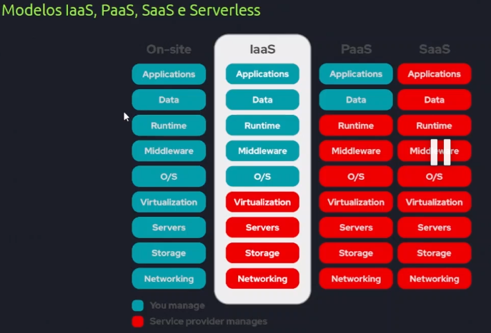

# Cloud Computing

## Cloud pública e Cloud privada

### Datacenters

Cloud privada: REDHAT, VMWARE

### Hypervisor

### Principais provedores
* aws
* Azure
* Google cloud

### Cloud Híbrida

## Modelo IaaS, PaaS, SaaS e Serverless

* IaaS: Infraestrutura como serviço

* PaaS: Plataforma as a service(plataforma como serviço)

* SaaS: Software as a service.

* Serverless:

## Principais Serviços

### AWS

* IAM: Serviço de identificação
* EC2: Virtualização e provisionamento
* RDS:
* DynamoDB: banco de dados não relacional
* S3: bucket armazenamento

## Well architected Framework

* Excelência Operacional
* Segurança
* Confiabilidade
* Eficiência e performance
* Otimização de custos
* Sustentabilidade

## Introdução a infraestrutura como código - Terraform

## CloudFormation
exclusivo AWS

## Introdução ao deployment em Cloud e esteiras de CI/CD

## SEGURANÇA EM CLOUD COMPUTING

* Física

* Lógica
