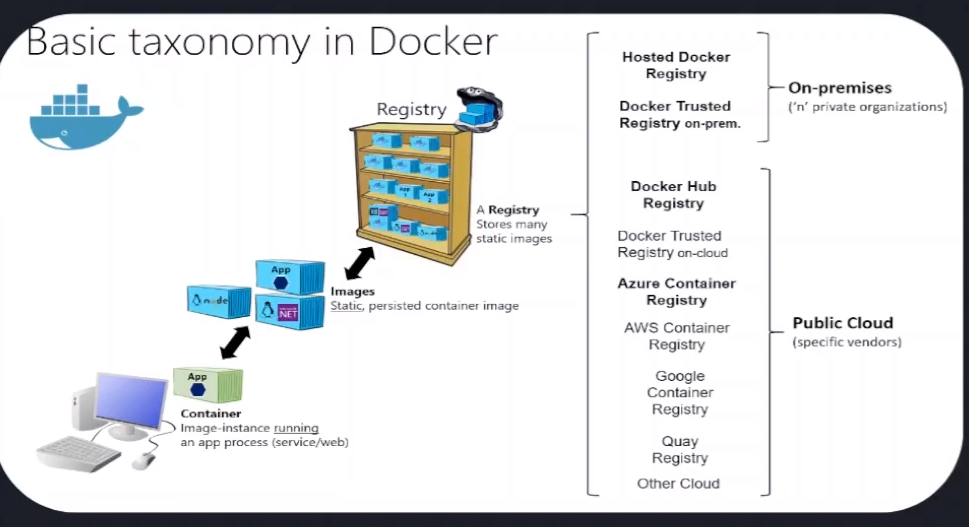

# CONTEINERIZAÇÃO COM DOCKER


Usamos containers para **isolar** e **otimizar aplicações e serviços, isolando-os em pequenos contextos que comunicam-se entre si. Podemos usar **Docker** (Uma ferramenta para materializar os conteiners em nossos sistemas) para testar nossas aplicações e rodar workliads em produção, melhorando o formato de gerar novos recursos, dar manutenção, escalar, etc. 

### O que é um container Docker?
Um container Docker é um pacote de software autossuficiente com todas as dependências necessárias para executar um aplicativo específico em diferentes sistemas operacionais. A imagem Docker dita todas as instruções de configuração para iniciar ou parar containers. Um novo container é criado sempre que um usuário executa uma imagem.

### Instalação do Docker

* Docker Desktop
* Linux Vs Outros S.O's
* Docker help

### Linux Install
Esse tutorial de instalação foi baseado no tutorial deste [link](https://www.hostinger.com.br/tutoriais/install-docker-ubuntu).

O Docker não está nos repositórios oficiais do Ubuntu. Porém, o processo de instalação não vai ser complicado por conta disso. Siga os passos abaixo.

#### 1. Atualize seu Sistema

```bash
$ sudo apt update
$ sudo apt upgrade
```

#### 2. Instale Pacotes de Pré-requisitos
Assim que atualizar o sistema, você deve instalar alguns dos pacotes necessários antes de instalar o Docker Ubuntu. Você pode fazer isso com a ajuda de um único comando:
```bash
$ sudo apt-get install  curl apt-transport-https ca-certificates software-properties-common
```
Para melhor entender o comando acima, aqui está uma curta descrição do que ele significa:

* **apt-transport-https** – permite que o gerenciador de pacotes transfira os tiles e os dados através de https
* **ca-certificates** – permite que o navegador da web e o sistema verifiquem certificados de segurança
* **curl** – transfere dados
* **software-properties-common** – adiciona scripts para gerenciar o software

#### 3. Adicione os repositórios do Docker
Agora você tem adicionar os repositórios do Docker. Isso vai fazer com que o processo de instalação seja muito mais fácil. Isso habilita você a usar o método oficial suportado de instalação.

Primeiro, você adiciona uma chave GPG, inserindo o comando a seguir na linha de comando do sistema:

```bash
$ curl -fsSL https://download.docker.com/linux/ubuntu/gpg | sudo apt-key add -
```
Agora, adicione o repositório executando este comando:

```bash
$ sudo add-apt-repository "deb [arch=amd64] https://download.docker.com/linux/ubuntu $(lsb_release -cs) stable"
```

Depois disso, apenas atualize a informação do repositório:
```bash
$ sudo apt update
apt-cache policy docker-ce
```
Garanta que você está instalando a partir do repositório do Docker, ao invés do repositório padrão do Ubuntu ao usar este comando:
```bash
$ apt-cache policy docker-ce
```
Como você pode ver, o docker-ce não está instalado, então podemos passar para o próximo passo.
#### 4. Instalar Docker Ubuntu
Estamos quase terminando. Use o comando para, enfim, instalar o Docker no Ubuntu.
```bash
$ sudo apt install docker-ce
```

#### 5. Verificar Status do Docker

```bash
$ sudo systemctl status docker
```

O resultado deve ser semelhante ao exibido abaixo:


## COMANDOS DO DOCKER
Os comandos são fundamentai para que possamos usufruir da ferramenta, permitindo que passemos instruções que serão executadas para que tudo funcione.

Como o Docker já foi instalado, tudo o que você precisa agora é usar a imagem de teste para verificar se tudo está funcionando como deveria. Faça isso usando o comando:

### Hello-world docker
```bash
$ sudo docker run hello-world
```
Resultado:
```bash
Hello from Docker!
This message shows that your installation appears to be working correctly.

To generate this message, Docker took the following steps:
 1. The Docker client contacted the Docker daemon.
 2. The Docker daemon pulled the "hello-world" image from the Docker Hub.
    (amd64)
 3. The Docker daemon created a new container from that image which runs the
    executable that produces the output you are currently reading.
 4. The Docker daemon streamed that output to the Docker client, which sent it
    to your terminal.

To try something more ambitious, you can run an Ubuntu container with:
 $ docker run -it ubuntu bash

Share images, automate workflows, and more with a free Docker ID:
 https://hub.docker.com/

For more examples and ideas, visit:
 https://docs.docker.com/get-started/
```
### Search - Procurar imagens
se você quiser procurar por imagens disponíveis, você só precisa usar o seguinte comando:
```bash
# sudo docker search [search_query]
$ sudo docker search windows
```
Resultado: 
```bash
NAME                                                       DESCRIPTION                                     STARS     OFFICIAL
rancher/windows_exporter-package                                                                           9         
rancher/windows-scheduler                                                                                  4         
dockurr/windows                                            Windows inside a Docker container.              201       
dockurr/windows-arm                                        Windows for ARM in a Docker container.          18        
antrea/windows-utility-base                                                                                4         
antrea/windows-golang                                                                                      5         
antrea/windows-ovs                                                                                         1         
sonobuoy/windows-plugin                                                                                    0         
lacework/win-golang                                        Windows with Go (golang)                        1         
docker/vpnkit-tap-vsockd                                   Helper program for vpnkit networking on wind…   0         
docker/vpnkit-forwarder                                    Part of the port forwarding mechanism in Doc…   1         
grafana/ci-build-windows                                   Windows CI build environment                    10        
marctv/minecraft-bedrock-server                            Minecraft Bedrock Server. Always up-to-date …   49        
rancher/windows-runtime-base                                                                               0         
apache/windows-nuttx                                       Apache NuttX (Windows)                          0         
seabreeze/windowsshellcommands                                                                             5         
windowsimagemicrosoft/sdk-3.5-windowsservercore-ltsc2019                                                   3         
cfcommunity/windows-stemcell-concourse                     For use with the Concourse tasks in the cf-c…   0         
spaceinvaderone/windows11_insider                          Download Windows 11 via UUP files from Windo…   8         
cloudfoundry/windows2016fs                                                                                 7         
windows10x64/docker101tutorial                                                                             0         
bmedora/windows-login-loadgen                                                                              0         
bonzofenix/windows-builder                                                                                 0         
slightlytyler/windows-test                                                                                 1         
calico/windows-upgrade   
```

###
Então, para fazer o download da imagem para o seu computador, use o nome da imagem junto com o comando a seguir:

```bash
# sudo docker pull [image_name]
$ sudo docker pull debian
```

### Listar imagens no sistema

```bash
$ sudo docker images
```

### Rodando uma imagem Docker
Depois disso, você pode executar a imagem usando o comando pull e a ID da imagem.

```bash
$ sudo docker run -i -t [image]
```
Existem opções que estendem a funcionalidade do comando. Por exemplo, a opção -i faz com que a execução da imagem seja interativa. Já a opção -d faz com que ela aconteça em segundo plano.

Assim que estiver executando uma imagem, podemos terminar a execução usando a combinação de teclas **CTRL+D**.

Finalmente, se você quiser usar o Docker sem privilégios root, basta usar o comando abaixo:

```bash
$ sudo usermod -aG docker $(whoami)
```

### Listar containers
```bash
$ sudo docker ps -a
```

## IMAGENS NO DOCKER


### Instruções DockerFile

* **FROM** - Base de sistema operacional que pode ser customizado, mas que servirá de base para as demais configurações que iremos executar;

* **WORKDIR** - Acessa um diretório;
* **ENV**  - Adiciona variáveis de ambiente;
* **RUN** - Roda comandos em tempo de execução;
* **CMD** - Ro comandos após o início do container, permitindo que o processo seja prioritário (caso usemos a instrução **ENTRYPOINT**), a prioridade será dele e o CMD será utilizado como argumento.

## CRIANDO CONTAINERS ATRAVÉS DE IMAGENS

### Imutabilidade
O conceito de imutabilidade garante que o que está rodando da minha máquina roda na de qualquer um. Independendte do sistema operacional, o conteúdo de uma imagem Docker deverá ser o mesmo.

