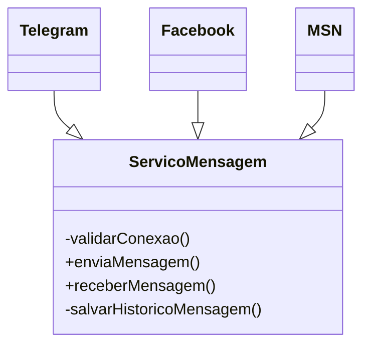

```mermaid
classDiagram
    class Telegram {
       
    }

    class Facebook {
       
    }

    class MSN {
    
    }

    class ServicoMensagem {
        -validarConexao()
        +enviaMensagem()
        +receberMensagem()
        -salvarHistoricoMensagem()
    }

    Telegram --|> ServicoMensagem 
    Facebook --|> ServicoMensagem 
    MSN --|> ServicoMensagem 
```